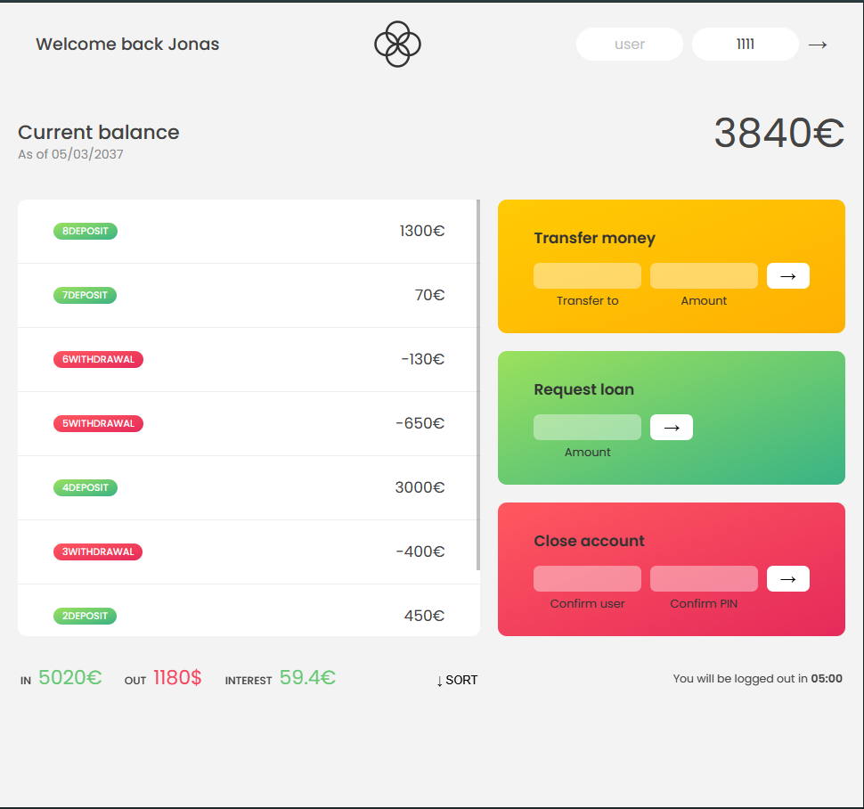

# bankist-app

## This project is based on a course by Jonas Schmedtmann. Original design by Jonas Schmedtmann.

A minimal,modern banking interface as part of Jonas Schmedtmann's JavaScript course. The application simulate core online-banking operations such as transfer, loan request, and account management using clean UI elements and DOM manipulation

# Overview

Bankist is a front-end focused project demonstrating:

-Realistic banking workflow
-State management in the browser
-DOM updates based on user interactions
-Array methods, timers, internationalization(Intl API),and event handling
-Clean UI smooth UX transitions

The app is fully client-side and users mock data only. No backend or persistent storage is included.

# Live Demo

# Demo

# Features

Authentication
-Log in with a present username and PIN
-Personalize welcome message
-Auto-logout timer to simulate secure session handling

# Account Operations

-View account movments(deposit,withdrawals)
-Display formatted datas and currency values
-Transfer money to another user
-Request a loan(validated using business logic)
-Close/delete account

# Additional Functionality

-Sort transactions ascending/descending
-Real-time UI updates
-Calculated summaries:
-Total balance
-Total income
-Total outgoing
-Total inters

Technologies Used
-HTML5
-CSS3
-vanilla JavaScript(ES6+)
-Int Number & Date Formatting API

# Demo

# How to use

- username: js PIN:1111
  -username: jd PIN:2222
  -username: stw PIN:3333

# Disclaimer

This project is for **learning and demonstration purposes only**
It does **not** include backend security, real authentication, or real financial functionality
Do **not** use it with real money or sensitive data.
